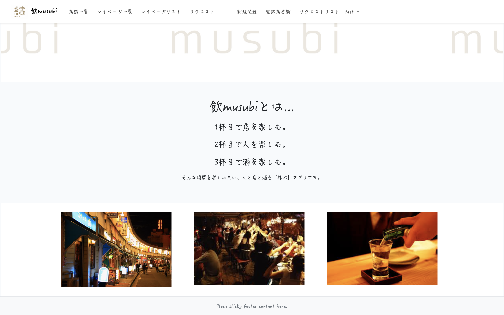

# アプリ名: <a href="https://nomusubi.herokuapp.com">飲musubi</a>
 飲musubiとは、  
 「人と店」    
 「人と人」    
 「人と酒」  
 をキーワードに、好みの店や酒、共通の好みの人を結ぶアプリケーションです。  

# 使用言語
PHP/Laravel/SCSS/Javascripit  

# 実装機能
- ユーザー登録、ログイン、ログアウト機能  
- 登録店一覧/投稿、削除、更新  
- マイページ一覧/投稿、削除、更新  
- 掲示板/投稿、削除、更新(掲示板への削除と更新についてはユーザー機能からは除外予定)  
- 管理者へお気に入り店の掲載リクエストを送付
- 店の新規登録(管理者のみ)      
- 店の更新、削除(管理者のみ)      
- リクエストリスト閲覧(管理者のみ)        

# 画面イメージ  

***<トップ画面です>***  
  

***<登録店一覧画面です>***  
  

***<登録店詳細画面です>***
  

# 使用方法
最初に会員登録をお願いいたします。  

会員登録完了後、以下の機能の使用が可能となります。

1. **登録店一覧の閲覧**  

2. **登録店のマイページの登録、削除**  
    店舗一覧から、詳細ページを見て気にいった店があれば「マイページに追加」を選択してください。  
    その店があなたのマイページに登録されます。  
    削除したい場合は、 マイページリストから「削除」を選択してください。  

3. **登録店掲示板の投稿、削除、更新**  
    登録店一覧から、店ごとの掲示板にコメントを投稿することができます。  

4. **管理者へお気に入りの店の掲載リクエストの送付**  
    お気に入りの店の掲載リクエストを管理者へ送付し、他のユーザーにも自分のお気に入りの店を共有できます。

5. **店の新規登録(管理者のみ)**  
   新しい店の新規登録が可能です。  
   画像は４枚投稿可能。  

6. **店の更新、削除(管理者のみ)**  
   登録店の更新画面から、リストの中のテキストの更新と削除を行うことが可能です。 

7. **リクエストリスト閲覧(管理者のみ)**  
   ユーザーから送られてきたリクエストの一覧です。
   リクエストのお店を新規登録画面から登録できます。

# 今後、実装していきたい機能  
- ユーザー自身で、お気に入りの店を登録することができる
- ユーザー間でのDM機能
  

 

